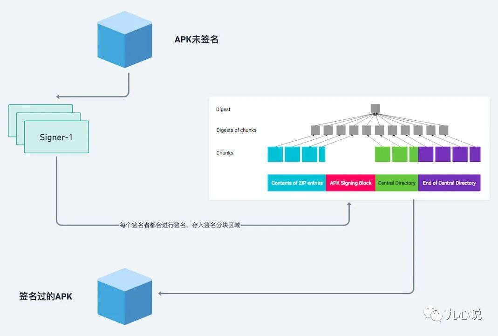

# Android签名

## APK 打包过程


* 打包资源文件，生成 R.java 文件
  - aapt 工具（aapt.exe） -> AndroidManifest.xml 和 布局文件 XMl 都会编译 -> R.java -> AndroidManifest.xml 会被 aapt 编译成二进制
  - res 目录下资源 -> 编译，变成二进制文件，生成 resource id -> 最后生成 resouce.arsc（文件索引表）
* 处理 aidl 文件，生成相应的 Java 文件
  * aidl 工具（aidl.exe）
* 编译项目源代码，生成 class 文件
* 转换所有 class 文件，生成 classes.dex 文件
  * dx.bat
* 打包生成 APK 文件
  * apkbuilder 工具打包到最终的 .apk 文件中
*  对APK文件进行签名
*  对签名后的 APK 文件进行对齐处理（正式包）
  * 对 APK 进行对齐处理，用到的工具是 zipalign

## 签名基础

### 消息摘要

消息摘要常常被被称为数字摘要或者数字指纹，定义如下：

> 在原来的数据基础上，经过一个单向的 Hash 计算，得到一个固定的 Hash 值，这就是消息摘要。

常见的摘要算法都有 MD5、SHA-1 和 SHA-256，特点如下：

1. 长度固定，与内容长度无关: 比如 MD5 是 128 位、SHA-1 是 160 位、SHA-256 是 256 位。
2. 看似随机，其实不随机: 同内容两次摘要得出的结果一致
3. 单向: 只能从原数据得出摘要，不能从消息摘要得出原来的数据。
4. 优秀的摘要算法很难 Hash 碰撞

基于此，消息摘要常常会被用来检查内容的完整性。

### 加密算法

> 将明文信息改变为难以读取的密文内容，使之不可读的过程。只有拥有解密方法的对象，经由解密过程，才能将密文还原为正常可读的内容。

所以啊，加密方法得到的密文是可以转变为明文的，像信息摘要算法比如 MD5 得出来的结果是不可逆的，所以面试官问你们什么是加密算法的时候，你可不能把 MD5 说进去！

加密算法分为两大类，「对称加密」和「非对称加密」。

简单对比一下对称加密和非对称机密：

|  |非对称加密|对称加密|
|--|--|--|
|速度|慢|快|
|效率|低|高|
|安全性|高|低|
|常见算法|RSA\DH|AES\DES\IDEA|

### 数字签名

数字签名的作用是为了消息的完整性。

数字签名的过程是这样的：

1. 我发送消息前，利用 Hash 算法针对数据得出一个摘要。
2. 我使用老妈的公钥对摘要内容进行加密，连同对称加密的数据一起发送过去。
3. 老妈接收到消息后，先利用对称密钥对内容解密，再进行 Hash 计算得出摘要。
4. 老妈使用私钥将摘要内容解密，和再次计算得出的摘要作对比，一致就代表消息无误。

上面的这种场景其实有点不妥，数字签名一般用在证书上，协商好对称密钥以后一般不会进行消息完整性校验了，不过大伙只要了解数字签名要来校验消息完整性就好。

截止现在，还有最后一个问题，我无法确认获取的公钥确实来自老妈。

### 数字证书

证书的作用很简单，证明公钥的身份。

对应的数字证书也有很多内容：

1. CA：证书的颁发机构。
2. 证书的有效期。
3. 公钥。
4. 证书的授予对象。

CA 将这些内容利用 CA 的私钥进行签名，用户使用 CA 的公钥验签，从而证明公钥的身份。

常见的证书分为两种：

1. 签名证书：由 CA 机构颁发，绝大部分网站都采用的这种方式。
2. 自签名证书：由服务器自己颁发给自己。

## Android签名机制

在 Android 中，也需要使用数字证书做数字签名，数字证书中公钥对应的私钥由开发者持有。

关于私钥和证书的生成方式，可以查看：[点击这里](https://developer.android.com/studio/publish/app-signing?hl=zh-cn#debug-mode)

在 Android Studio 中，最终会生成一个 .jks 的文件，早期 Eclipse 是 .keystore，它们都是用作证书和私钥的二进制文件。

App 如果使用了一种私钥签名，另外一个私钥签名的文件将无法安装或覆盖老的版本，这样做是为了防止已经安装的 App 被恶意的第三方覆盖。

### Android签名机制的异同点

Android 中数字签名的生成和普通的数字签名并没有很大的区别。

但是进行数字签名的证书可以采用自签名证书，即不需要权威证书颁发机构（CA）来做背书，因为它的作用是用来标识应用程序的开发者，下载的用户并不需要这个证书来下载该 App。

### Debug和Relase的签名

当我们在IDE中运行或调试项目时，AS 会自动使用 Android SDK 工具生成的调试证书为我们的应用签名，路径为 $HOME/.android/debug.keystore，但是应用商店可不接受使用调试证书发布的应用签名。

打包Release时，我们一般会在 app 模块中的 build.gradle 进行配置：

```gradle
android {
    ...
    signingConfigs {
        release {
            storeFile file("release.keystore")
            storePassword "******"
            keyAlias "******"
            keyPassword "******"
        }
    }
}
```

这些都是我们生成 .jks 或者 .keystore 需要生成的参数。

## 签名方案

- v1 方案：基于 JAR 签名。
- v2 方案：解决 JAR 签名方案的安全性问题和渠道包，在 Android 7.0 引入。
- v3 方案：v2 升级版，在 Android 9.0 引入。
- v4 方案：Android 11.0 引入，用来支持 ADB 增量 APK 安装。

### 签名工具

* **jarsigner**：jdk 自带的签名工具，对 jar 进行签名。使用 keystore 文件进行签名，生成的签名文件默认使用 keystore 的别名命名。
* **apksigner**：Android sdk 提供的专门用于 Android 应用的签名工具。使用 pk8、x509.pem 文件进行签名。 pk8 是私钥文件，x509.pem 是含有公钥的文件。生成的签名文件统一使用“CERT”命名。

### V1 签名

#### V1 签名流程


#### V1 校验流程


- 检查 APK 中包含的所有文件，对应的摘要值与 MANIFEST.MF 文件中记录的值一致。
- 使用证书文件（RSA 文件）检验签名文件（SF 文件）没有被修改过。
- 使用签名文件（SF 文件）检验 MF 文件没有被修改过。

#### V1 签名弊端

* 签名检验速度慢：对所有文件进行摘要绩，如果 Android 机器差，安装速度慢。
* 完整性保障不够：仅针对 ZIP 条目校验，META-INF 文件不会计入校验过程。这样会导致即使我 Apk 已经签过名，工程师也可以移动条目顺序并重新压缩，也可以修改 META-INF 文件下的内容，带来一些安全隐患，早期的多渠道打包就是在这里做的文章。

### V2 签名

v2 是一种**全文件签名方案**，能够发现对 APK 的受保护部分进行的所有更改，从而有助于加快验证速度并增强完整性保证。它解决了 v1 遗留的签名校验慢和完整性的问题。

v2 将**验证归档中的所有字节**，而不是单个 ZIP 条目，因此，在签署后无法再运行 ZIPalign（必须在签名之前执行）。正因如此，现在，在编译过程中，Google 将**压缩、调整和签署合并成一步完成**。

v2 会在原先 APK 块中增加了一个**新的块（签名块）**，新的块存储了签名、摘要、签名算法、证书链和额外属性等信息，这个块有特定的格式。最终的签名APK其实就有四块：头文件区、V2签名块、中央目录、尾部。下图是V1签名和V2签名的组成。


相对与 v1 签名方案，v2 签名方案不再以文件为单位计算摘要了，而是以 **1 MB 为单位**将文件拆分为多个连续的块（chunk），**每个分区**的最后一个块可能会小于 1 MB。

v1 的组成部分其实就和 Before signing 那一块儿一样，v2 多了红色区域，我们称之为APK签名分块。

从保护的内容来看，v1 仅保护内容1，v2 保护的区域有 1、3、4 和 2 的 signed data 区域，signed data 是 1、3 和 4 得出来的摘要等信息。

#### V2 签名过程



就一个 App 而言，它可能有一个或者多个签名者，对于每个签名者而言，都会进行签名过程。

v2 没有对每个文件都进行计算，而是针对的所有字节。它将 1、3 和 4 区域都拆分成了大小为 1MB 的连续块，计算方式如下：

1. 每个小块都按：字节 0xa5 + 块字节长度 + 块内容 进行计算。
2. 每个1、3 和 4 块都按：字节 0xa5 + 块数 + 小块摘要 进行计算。

最后，将这些一个或者多个签名者的摘要、证书等信息都打包到 Apk 中。

#### V2 签名校验

1. 找到APK签名分块区域。
2. 每找到一个签名者，都会验证：签名算法、信息摘要、证书和公钥。
3. 所有的签名者都验证通过了，APK 验证才会通过。

### V3 签名

v3 签名在v2的基础上，仍然采用检查整个压缩包的校验方式。不同的是在签名部分增可以添加新的证书，即可以不用修改 ApplicationID 来完成证书的更新迭代，目标是解决在更新过程中更改签名密钥的问题。

其实 v3 就是加入了证书的**旋转校验**，即可以在一次的升级安装中使用新的证书，新的私钥来签名APK。当然这个新的证书是需要老证书来保证的，类似一个证书链。

所以 APK 签名分块中 添加了两部分内容：

1. Proof-of-rotation: 一个存在替换的所有旧签名证书的链表，根节点是最旧的证书。
2. SDK 版本支持。


签名机制主要有两种用途：

- 使用特殊的 key 签名可以获取到一些不同的权限
- 验证数据保证不被篡改，防止应用被恶意的第三方覆盖

### V4 签名

如果同学们经常玩一些主机游戏，可以发现，在 PS5 或者 Swtich 上，一些游戏即使没有安装完成，我们也可以打开游戏玩一些基本功能，比如我以前常玩的 NBA 2k 系列。

Android 11 中谷歌也新增了 「ADB增量APK安装」 功能，比如一个 APK 有 2GB，我下载完 50 MB 以后，就可以使用一些基本功能，剩余的文件通过后台流式传输，不过 Android 11 中的这个功能是面向 ADB 的。

虽然这个功能很赞，但是对签名方案带来了一些挑战，之前的方案都是基于所有文件进行校验的，于是推出 Android 第四代签名方案 v4。

v4 基于 APK 所有的字节计算出 Merkle Hash 树，并将 Merkle 树的根 Hash、盐值作为签名数据进行包完整性校验，v4 签名必须单独存在 .idsig 文件中，不会存在于 APK 文件中，所以 apk 文件中仍然需要 v2 或者 v3 签名。

### 签名兼容

Android 中的签名方案是自上而下兼容的


对于 Android 11 来说，验证过程是这样的：

1. 是否支持 v4，v4 验证完了再验证 v3 或者 v2
2. v4 不通过，验证 v3
3. v3 不通过，验证 v2
4. v2 不通过，验证 v1
5. v1 不通过，安装失败

对于 Android 9 来说，就得从 v3 方案开始验证的。

## 3 总结

| 版本 | 简介                                                         |
| ---- | ------------------------------------------------------------ |
| v1   | 签名以文件的形式存在于apk包中，这个版本的apk包就是一个标准的zip包 |
| v2   | 签名信息被塞到了apk文件本身中，这时apk已经不符合一个标准的zip压缩包的文件结构 |
| v3   | 添加了一种更新证书的方式，这部分更新证书的数据同样被放在了签名信息中 |
| v4   | 新增了 「ADB增量APK安装」 功能 |

## 4 参考

[详解Android v1、v2、v3签名(小结）](https://www.jb51.net/article/174939.htm)

[Android P v3签名新特性](https://blog.csdn.net/bobby_fu/article/details/103843038)