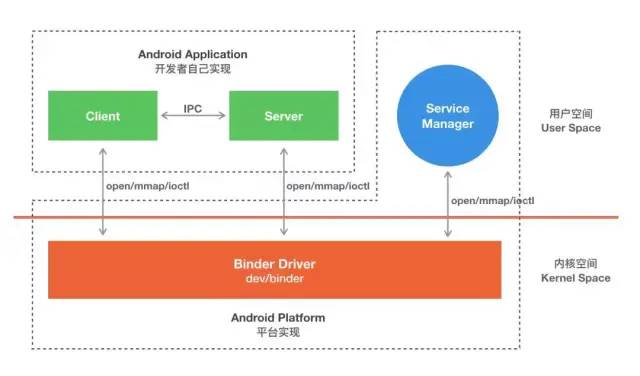

## 1 简介

Binder 中文译为粘合剂，它把系统中各个组件粘合到了一起，是各个组件的桥梁。Binder 是Android 系统中进程间通讯（IPC）的一种非常重要的方式，区别于传统的 Linux IPC 机制。

## 2 Linux 的 IPC 机制

### 2.1 管道（PIPE）

用于进程间通信的一段共享内存，创建管道的进程称为管道服务器，连接到一个管道的进程为管道客户机。一个进程在向管道写入数据后，另一进程就可以从管道的另一端将其读取出来。用于父子进程或者兄弟进程之间，具有亲缘关系的进程之间的通信。

* 继承自Unix，半双工通信方式（数据只能在一个方向上流动）;
* 原理：通信双方利用内存的共享文件来传递信息；

### 2.2 命名管道（FIFO）

是一种特殊类型的文件，它在系统中以文件形式存在。克服了管道的弊端允许没有亲缘关系的进程间通信。 

### 2.3 信号（signal）

信号机制是unix系统中最为古老的进程之间的通信机制，用于一个或几个进程之间传递异步信号。信号可以有各种异步事件产生，比如键盘中断等。shell 也可以使用信号将作业控制命令传递给它的子进程。

* 异步通信方式,软件层对中断机制的一种模拟,例如内核通知用户空间进程发生了哪些系统事件
* 不适用于信息交换，适用于进程中断控制;

### 2.4 消息队列（Message queues）

是内核地址空间中的内部链表，通过 linux 内核在各个进程直接传递内容，消息顺序地发送到消息队列中，并以几种不同的方式从队列中获得，每个消息队列可以用 IPC 标识 唯一地进行识别。内核中的消息队列是通过 IPC 的标识符来区别，不同的消息队列直接是相互独立的，每个消息队列中的消息，又构成一个 独立的链表。
消息队列克服了信号承载信息量少，管道只能承载无格式字符流。 

* 具有特定格式的消息链表，存放在内存中并由消息队列标识符标识，并且允许一个或多个进程向它写入与读取消息;
* 信息会复制两次，因此对于频繁或者信息量大的通信不宜使用消息队列;

### 2.5 信号量（Semaphore）

是一种计数器，用于控制对多个进程共享的资源进行的访问。常常被用作一个锁机制，在某个进程正在对特定的资源进行操作时，信号量可以防止另一个进程去访问它。 
信号量是特殊的变量，它只取正整数值并且只允许对这个值进行两种操作：等待（wait）和信号（signal），简单来说就是PV操作，P用于等待，V用于信号 ，P 相当于申请资源，V 相当于释放资源 。

* P(sv)：sv > 0，就减 1；sv == 0，就挂起该进程的执行 
* V(sv)：如果有其他进程因等待 sv 而被挂起，就让它恢复运行；如果没有其他进程因等待 sv而挂起，则给它加1 。

### 2.6 共享内存（Share Memory）

多个进程之间共享内存区域的一种进程间的通信方式，由 IPC 为进程创建的一个特殊地址范围，它将出现在该进程的地址空间中。其他进程可以将同一段共享内存连接到自己的地址空间中。所有进程都可以访问共享内存中的地址，就好像它们是 malloc 分配的一样。如果一个进程向共享内存中写入了数据，所做的改动将立刻被其他进程看到。 

* 多个进程读写一块内存空间，由需要访问的进程将其映射到自己的私有地址空间，不需要进行数据的拷贝，效率较高;

### 2.7 内存映射（Memory Map）

**内存映射文件**，是由一个文件到一块内存的映射。内存映射文件与 虚拟内存有些类似，通过内存映射文件可以保留一个地址的区域，
同时将物理存储器提交给此区域，内存文件映射的物理存储器来自一个已经存在于磁盘上的文件，而且在对该文件进行操作之前必须首先对文件进行映射。使用内存映射文件处理存储于磁盘上的文件时，将不必再对文件执行I/O操作。 每一个使用该机制的进程通过把同一个共享的文件映射到自己的进程地址空间来实现多个进程间的通信（这里类似于共享内存，只要有一个进程对这块映射文件的内存进行操作，其他进程也能够马上看到）。
使用内存映射文件不仅可以实现多个进程间的通信，还可以用于处理大文件提高效率。因为我们普通的做法是把磁盘上的文件先拷贝到内核空间的一个缓冲区再拷贝到用户空间（内存），用户修改后再将这些数据拷贝到缓冲区再拷贝到磁盘文件，一共四次拷贝。如果文件数据量很大，拷贝的开销是非常大的。那么问题来了，系统在在进行内存映射文件就不需要数据拷贝？mmap()确实没有进行数据拷贝，真正的拷贝是在在缺页中断处理时进行的，由于mmap()将文件直接映射到用户空间，所以中断处理函数根据这个映射关系，直接将文件从硬盘拷贝到用户空间，所以只进行一次数据拷贝。效率高于read/write。

### 2.8 套接字（socket）

套接字机制不但可以单机的不同进程通信，而且使得跨网机器间进程可以通信。它明确地将客户端与服务器 区分开来，可以实现多个客户端连到同一服务器。 

* 可用于不同机器之间的进程间通信

## Binder 跨进程通信原理

### 为什么要使用Binder

#### 1. 性能

主要影响的因素是拷贝次数：

1. 管道、消息队列、Socket的拷贝次书都是两次，性能不是很好；
2. 共享内存不需要拷贝，性能最好；
3. Binder拷贝1次，性能仅次于共享内存；

#### 2. 稳定性

从稳定性的角度讲，Binder是优于共享内存的。

1. Binder是基于C/S架构的，技术上已经很成熟，稳定；
2. 共享内存没有分层，难以控制，并发同步访问临界资源时，可能还会产生死锁；

#### 3.  安全

Android是一个开源的系统，并且拥有开放性的平台，市场上应用来源很广，因此安全性对于Android 平台而言极其重要。传统的IPC接收方无法获得对方可靠的进程用户ID/进程ID（UID/PID），无法鉴别对方身份。Android 为每个安装好的APP分配了自己的UID， 通过进程的UID来鉴别进程身份。另外，Android系统中的Server端会判断UID/PID是否满足访问权限，而对外只暴露Client端，加强了系统的安全性。

#### 4. 语言

* Linux是基于C语言，C语言是面向过程的，Android应用层和Java Framework是基于Java语言，Java语言是面向对象的。
* Binder本身符合面向对象的思想，因此作为Android的通信机制更合适。

### Android中Binder的来源

Binder是基于开源的OpenBinder实现的，OpenBinder最早并不是由Google公司开发的，而是Be Inc公司开发的，接着由Palm, Inc.公司负责开发。后来OpenBinder的作者Dianne Hackborn加入了Google公司，并负责Android平台的开发工作，顺便把这项技术也带进了Android。

### 基于Binder通信的C/S架构

* 系统在启动时，SystemServer进程启动后会创建Binder线程池，目的是通过Binder，使得在SystemServer进程中的服务（如AMS、PMS）可以和其他进程进行通信；
* 我们常说的AMS、PMS都是基于Binder来实现的，再比如Client端的MediaPlayer和Server端的MeidaPlayerService不是运行在一个进程中的，同样需要Binder来实现通信。
* Binder 是基于 C/S 架构的,其中 Client进程、Server进程、Service Manager进程 运行在用户空间，Binder驱动 运行在内核空间。Client、Server 和 ServiceManager 之间的交互通过系统调用 open、mmap 和 ioctl 来访问设备文件 /dev/binder（Binder驱动，在内核空间通过mmap实现跨进程通信），间接的实现跨进程通信。
* Binder驱动，Service Manager进程 属于 Android基础架构（系统已经实现好了）；
* Client 进程 和 Server 进程 属于Android应用层（需要开发者自己实现）

## Android中的IPC机制

### Android中的IPC机制

#### 序列化

* Serializable: java提供,空接口,开销大,大量的IO操作;
* Parcelable: android提供,通过intent,binder传递,效率要更高,我们常用的Bundle就是其实现类;

> Serializable与Parcelable区别
> - Serializable：Java 序列化接口，在硬盘上读写，读写过程中有大量临时变量的生成，内部执行大量的i/o操作，效率很低
> - Parcelable：Android 序列化接口，效率高, 使用麻烦, 在内存中读写（AS有相关插件 一键生成所需方法），对象不能保存到磁盘中;

### AIDL

#### 服务端:

- 创建要操作的实体类，实现 Parcelable 接口
- 新建aidl文件夹，在其中创建接口aidl文件以及实体类的映射aidl文件
- Make project
- 服务service中实现AidlInterface.Stub对象, 并在onBind方法中返回

#### 客户端:

- copy服务端提供的aidl文件夹和实体类
- Make project
- ServiceConnection.onServiceConnected方法中调用AidlInterface.Stub.asInterface(IBinder)创建AidlInterface实例,并调用其方法

### Bundle

- 实现了Parcelable接口，所以它可以方便的在不同的进程间传输。
- 四大组件中的Activity,Service,Receiver都支持使用Bundle传递数据,所以当我们启动不同进程的组件时,就可以用Intent+bundle进行数据传递

### 共享文件和SharedPreferences

- 两个进程通过读写同一个文件来交换数据
- 对象可以通过序列化和反序列化进行读写
- SharedPreferences本质就是读写文件

### Messenger(信使,轻量级的IPC方案)

- 通过它可以在不同进程间传递Message对象
- 底层其实就是AIDL, 只是进一步进行了封装, 以方便使用,从下面这个构造方法就可以看出

### Socket

- 分为 流式套接字 和 用户数据报套接字 两种, 分别对应于网络的传输控制层中的TCP和UDP协议
- TCP: 面向连接的协议,提供稳定的双向通信功能,连接的建立需要经过三次握手才能完成, 为了提供稳定的数据传输功能,其本身提供了超时重传机制
- UDP: 无连接,提供不稳定的单向通信功能(也可以实现双向通信),具有更好的效率,但不能保证数据一定能 正确传输,尤其是在网络拥塞的情况下

### ContentProvider

- Android中提供的专门用于不同应用间进行数据共享的方式,天生就适合进程间通信
- 底层实现同样也是Binder,而且比AIDL要简单
- 需要注意的: CRUD操作,防止SQL注入,权限控制
- 系统中预制了许多ContentProvider,如通讯录,日程表信息等
- query,insert,delete,update是运行在Binder线程中的, 存在多线程并发访问,方法内部要做好线程同步 ,例如BookProvider中采用了SQLite,并且只有一个SQLiteDatabase的链接, 所以可以正确的应对多线程情况, 因为SQLiteDatabase内部对数据库的操作是有同步处理的
- onCreate运行在main线程(UI线程),不能进行耗时操作

### Binder

- 基于Binder的: AIDL,Messenger,ContentProvider
- 从Android Framework角度讲,Binder是ServiceManager链接各种Manager(ActivityManager,WindowManager等)和ManagerService的桥梁
- 从Android 应用层来说,Binder是客户端和服务端进行通信的媒介(bindService)
- Binder主要用在Service中,包括普通的Service,AIDL和Messenger
- 普通的Service中的Binder不涉及进程间通信,没有触及到Binder的核心

## 参考阅读

* [linux基础——linux进程间通信（IPC）机制总结](https://blog.csdn.net/a987073381/article/details/52006729)
* [一篇文章了解相见恨晚的 Android Binder 进程间通讯机制](https://jeanboy.blog.csdn.net/article/details/70082302?utm_medium=distribute.pc_relevant.none-task-blog-BlogCommendFromMachineLearnPai2-3.control&dist_request_id=&depth_1-utm_source=distribute.pc_relevant.none-task-blog-BlogCommendFromMachineLearnPai2-3.control)
* [Binder学习指南](http://weishu.me/2016/01/12/binder-index-for-newer/)
* [Android进阶笔记-5. IPC机制 & Binder 原理](https://mp.weixin.qq.com/s/pLVgIQEjvxacZ__QtvT2GQ)