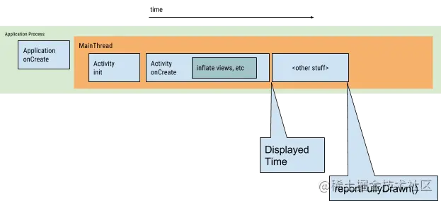
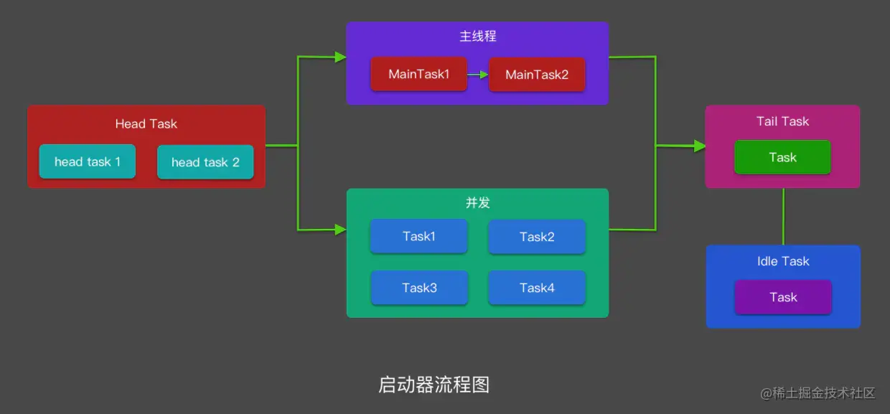

# 启动优化

## 启动优化有哪些优化方向？

应用有三种启动状态，每种状态都会影响应用向用户显示所需的时间：冷启动、温启动或热启动。在冷启动中，应用从头开始启动。在另外两种状态中，系统需要将后台运行的应用带入前台。
本文所说的启动优化都是指冷启动优化
要优化应用以实现快速启动，了解系统和应用层面的情况以及它们在各个状态中的互动方式很有帮助。

### 冷启动

冷启动是指应用从头开始启动：系统进程在冷启动后才创建应用进程。
发生冷启动的情况包括应用自设备启动后或系统终止应用后首次启动。
这种启动给最大限度地减少启动时间带来了最大的挑战，因为系统和应用要做的工作比在另外两种启动状态中更多。

在冷启动开始时，系统有三个任务：

1. 加载并启动应用。
2. 在启动后立即显示应用的空白启动窗口。
3. 创建应用进程。

系统一创建应用进程，应用进程就负责后续阶段：

1. 创建应用对象。
2. 启动主线程。
3. 创建主`Activity`
4. 填充视图。
5. 布局屏幕。
6. 执行初始绘制。

一旦应用进程完成第一次绘制，系统进程就会换掉当前显示的后台窗口，替换为主 Activity。此时，用户可以开始使用应用。



如上所示，Application与Activity的生命周期就是我们的优化方向，一般为Application onCreate方法与首个Activity加载耗时。

## 如何测量启动时间？

### 最简单方法

通过查看logcat可以快速了解启动时间
在Android Studio Logcat中过滤关键字`Displayed`，可以看到对应的冷启动耗时日志。

### 命令测量

```shell
for i in `seq 1 10`
do
  adb shell am force-stop com.xx.xx
  sleep 2
  adb shell am start-activity -W -n 包名/activity名称 | grep "TotalTime" | cut -d ' ' -f 2
done
```

有时候我们需要统计app的冷启动性能，单次结果往往不准确 还需要多次统计以后做平均值
如上，使用脚本启动10次首页Activity,可以比较准确的获取冷启动性能

命令测量方式线下使用方便，可以测试竞品，但是不能带到线上,不能精准控制测量时间，所以我们通常还需要手动埋点

### 埋点测量

埋点测量关键点在于合适的开始与结束时间
我们一般使用`Application attachBaseContext`作为开始时间
而启动结束时间则有很多选择

### IdleHandler

IdleHandler在MessageQueue空闲时会回调,也就是所在线程任务已经执行完时，线程处于空闲状态时才会执行Idle列表中的任务。

正常情况下，当主线程程处于空闲状态时，可以认为冷启动已经完成，是一个比较不错的打点时机
但有个问题，如果UI线程的任务一直不执行完呢？如果有其他任务加入了MessageQueue但是页面已经可见了呢？

IdleHandler具有一定的不可控特性，读者可根据项目特性判断是否使用

### onWindowFocusChanged

当Activity回调`onWindowFocusChanged`时，我们可以认为Activity已经可见了，所以可以在此时打点

不过onWindowFocusChanged 方法只是 Activity 的首帧时间，是 Activity 首次进行绘制的时间，首帧时间和界面完整展示出来还有一段时间差，不能真正代表界面已经展现出来了。

但是onWindowFocusChanged方式与业务耦合少，侵入性低，使用起来比较方便

在我们的项目中回调时间与界面展示时间相差很少，可以作为一种可选方案，根据实际情况使用

### onPrewDrawListener

如上面所说，正确的计算启动耗时的时机是要等真实的数据展示出来，比如在列表第一项的展示时再计算启动耗时。
我们可以在给列表的第一项添加onPreDrawListener监听，这种方式比较准确
不过这种方式与业务代码强相关，侵入性较大。读者也可根据实际情况使用

### TraceView与SystraceView使用

#### TraceView

TraceView可以跟踪 App 某段时间内所有调用过的方法，这是测量应用执行性能常用的方式之一.

通过它我们可以查出 App 启动时具体都调用了方法，都花了多长时间。

这个功能是 Android 系统提供的，我们可以通过在代码里手动调用 android.os.Debug.startMethodTracing() 和 stopMethodTracing() 方法来开始和结束 Tracing，然后系统会把 Tracing 的结果保存到手机的 .trace 文件里。

此外，除了通过写代码来 Trace，我们也有更方便的方式。例如也可以通过 Android Studio Profiler 里的 Method Tracer 来 Trace。但是，针对 App 的冷启动，我们则通常会用 Android 系统自带的 Am 命令来跟踪，因为它能准确的在 App 启动的时候就开始 Trace：

```shell
# 启动指定 Activity，并同时进行采样跟踪,-P在app进入idle状态时profiler结束
adb shell am start -n com.xxx.android/com.xxx.android.app.ui.activity.MainActivity -P /data/local/tmp/xxx-startup.trace --sampling 1000
# 拉取 .trace 文件到本机当前目录
adb pull /data/local/tmp/xx-startup.trace .
```

在启动结束后，通过adb pull拉取trace文件后，直接拖到android studio中打开就可以查找耗时方法了

#### Systrace

TraceView 虽然是找出耗时方法的利器，但是执行 TraceView 时的运行环境和用户最终运行的环境会有极大的差距，因为 TraceView 会严重拖慢 App 的执行速度。即使使用采样跟踪，测量得到的结果和实际结果肯定还是有很大偏差，只能作为参考。

而且 TraceView 更偏向于追查应用的内因，对于运行环境等外因（锁、GC、资源匮乏等）的追查显得很无力。

所以，我们可以借助另一个 Google 官方极力推荐的工具 - 「Systrace」来跟踪 App 实际运行时的情况

运行app后，手动杀掉。然后cd 到SDK 目录下的 platform-tools/systrace 下，使用命令：

```shell
python systrace.py -t 10 -o /Users/xxx/trace.html -a com.xx.xxx
```

其中：-t 10是指跟踪10秒，-o 表示把文件输出到指定目录下，-a 是指定应用包名。

输入完这行命令后，可以看到开始跟踪的提示。看到 Starting tracing 后，手动打开我们的应用。

#### 小结

1. TraceView可以用来定位具体耗时的方法
2. TraceView运行时开销严重，导致整体性能变慢，可能会带偏优化方向
3. Systrace开销小，可以直观反映Cpu使用率，便于查找运行环境等外因(锁,GC)等引起的问题
4. TraceView与Systrace都可以埋点，指定关心的区域

## 常规优化手段

### Theme切换

Theme设置可以说是启动优化的一个必备手段了

启动Activity的windowBackground主题属性预先设置一个启动图片（layer-list实现），在启动后，在Activity的onCreate()方法中的super.onCreate()前再setTheme(R.style.AppTheme)。

优点

1. 使用简单。
2. 避免了启动白屏和点击启动图标不响应的情况。

缺点

1. 治标不治本，表面上产生一种快的感觉。

### 异步方案

我们通常会在Application的onCreate中初始化很多任务，比如第三方库初始化，而且是串行的

这些初始化任务的耗时通常还不小，所以一个优化思路就是并行的初始化，这样就将初始化耗时从加法变成了求最大值

> 核心思路：子线程分担主线程任务，并行减少时间

#### 常规异步方案的问题

1. 代码不够优雅: 假如我们有 100 个初始化任务，那我们就需要提交 100 次任务。
2. 无法限制在 onCreate 中完成: 有的第三方库的初始化任务需要在 Application 的 onCreate 方法中执行完成，虽然可以用 CountDownLatch 实现等待，但是还是有点繁琐。
3. 无法实现存在依赖关系: 有的初始化任务之间存在依赖关系，比如极光推送需要设备ID，而 initDeviceId() 这个方法也是一个初始化任务。

#### 异步启动器方案

上面介绍了常规异步方案的几个问题，我们可以通过启动器来解决。启动器的核心思想是充分利用多核 CPU ，自动梳理任务顺序。



1. 第一步是我们要对代码进行任务化，任务化是一个简称，比如把启动逻辑抽象成一个任务。
2. 第二步是根据所有任务的依赖关系排序生成一个有向无环图，这个图是自动生成的，也就是对所有任务进行排序。比如我们有个任务 A 和任务 B，任务 B 执行前需要任务 A 执行完，这样才能拿到特定的数据，比如上面提到的 initDeviceId。
3. 第三步是多线程根据排序后的优先级依次执行，比如我们现在有三个任务 A、B、C。假如任务 B 依赖于任务 A，这时候生成的有向无环图就是 ACB，A 和 C 可以提前执行，B 一定要排在 A 之后执行。

#### JetPack App Startup

优点：

- App Startup 这个库提供了一个组件，可以在应用程序启动的时候初始化。
- 开发人员可以使用这个组件精简启动序列和显式地设置初始化的顺序。 　
- 我们不需要为每个组件定义单独的 ContentProvider,App Startup 允许您定义的所有组件化共享一个内容提供者。

缺点：

- App Startup只是支持将多个ContentProvider合并到一个ContentProvider中，并指定一定依赖顺序
- 它的推出的目的，是管理第三方库使用ContentProvider过多，导致启动速度变慢的问题
- 不支持异步与异步任务管理

#### 阿里-alpha

> Alpha是一个基于PERT图构建的Android异步启动框架，它简单，高效，功能完善。 在应用启动的时候，我们通常会有很多工作需要做，为了提高启动速度，我们会尽可能让这些工作并发进行。但这些工作之间可能存在前后依赖的关系，所以我们又需要想办法保证他们执行顺序的正确性。Alpha就是为此而设计的，使用者只需定义好自己的task，并描述它依赖的task，将它添加到Project中。框架会自动并发有序地执行这些task，并将执行的结果抛出来。 由于Android应用支持多进程，所以Alpha支持为不同进程配置不同的启动模式。

alpha已经基本满足我们的使用，不过它不支持任务是否需要等待，同时它的代码比较旧，感觉已经很久不维护了

#### AnchorTask

1. 支持多任务并发执行
2. 支持任务间依赖与拓扑排序
3. 支持任务监听与耗时统计
4. 支持指定任务优先级
5. 支持指定是否在主线程运行与是否等待

### 延迟初始化方案

#### 常规延迟初始化方案

有些任务我们需要延迟加载，常规方法是通过Handler.postDelayed方法发送一个延迟消息，比如延迟到 100 毫秒后执行。

问题：

1. 时机不便控制,无法确定一个合适的延迟时间
2. 代码不够优雅，维护成本高,如果有多个任务，需要添加多次
3. 可能造成主线程卡顿，假如把任务延迟 200 毫秒后执行，而 200 后用户还在滑动列表，那还是会发生卡顿。

#### 更优方案

核心思想：对延迟任务进行分批初始化 利用IdleHandler在当前消息队列空闲时执行的特性，实现一个延迟启动器

IdleHandler在返回true时会继续监听，返回false结束监听，因此在任务全部完成后返回false即可

```java
public class DelayInitDispatcher {

    private Queue<Task> mDelayTasks = new LinkedList<>();

    private MessageQueue.IdleHandler mIdleHandler = new MessageQueue.IdleHandler() {
        @Override
        public boolean queueIdle() {
            if(mDelayTasks.size()>0){
                Task task = mDelayTasks.poll();
                new DispatchRunnable(task).run();
            }
            return !mDelayTasks.isEmpty();
        }
    };

    public DelayInitDispatcher addTask(Task task){
        mDelayTasks.add(task);
        return this;
    }

    public void start(){
        Looper.myQueue().addIdleHandler(mIdleHandler);
    }

}
//调用
DelayInitDispatcher delayInitDispatcher = new DelayInitDispatcher();
delayInitDispatcher.addTask(new DelayInitTaskA())
        .addTask(new DelayInitTaskB())
        .start();

```

### 极致懒加载与提前加载

#### 首页极致懒加载

的首页通常有多个tab,而当我们启动时，只需要初始化一个tab即可, 我们通常会利用ViewPager来实现简单的懒加载，比如只有当Fragment可见时才去进行网络请示

这样有一定效果，但是View的inflate,measure,layout也需要一定时间, 更加极致的懒加载方案如下：

1. 首屏加载时，只往ViewPager中塞入默认要展示的tab，剩余的tab用空的占位Fragment代替
2. 占位Fragment中只有一个空白的FrameLayout
3. 当占位Fragment可见时，将真正要展示的Fragment添加到空白FrameLayout，进行真正的初始化

通过这种方案，可以做到在启动时，只inflate,measure,layout首页Fragment的View,其他Tab只有可见时才会填充

#### 布局预加载

官方提供了一个类，可以来进行异步的inflate，但是有两个缺点：

1. 每次都要现场new一个出来
2. 异步加载的view只能通过callback回调才能获得，使用不方便（死穴）
3. 如果在Activity中进行初始化，通过callback回调时，并没有减少加载时间，仍然需要等待

由于以上问题，一个思考方向就是，能不能提前在子线程inflate布局，然后在Activity中通过id取出来, 核心思想如下

1. 初始化时在子线程中inflate布局，存储在缓存中
2. Activity初始化时，先从缓存结果里面拿 View，拿到了view直接返回
3. 没拿到view，但是子线程在inflate中，等待返回
4. 如果还没开始inflate，由UI线程进行inflate

优点：

可以大大减少 View 创建的时间，使用这种方案之后，获取 View 的时候基本在 10ms 之内的。

缺点：

- 由于 View 是提前创建的，并且会存在在一个 map，需要根据自己的业务场景将 View 从 map 中移除，不然会发生内存泄露
- View 如果缓存起来，记得在合适的时候重置 view 的状态，不然有时候会发生奇奇怪怪的现象。
