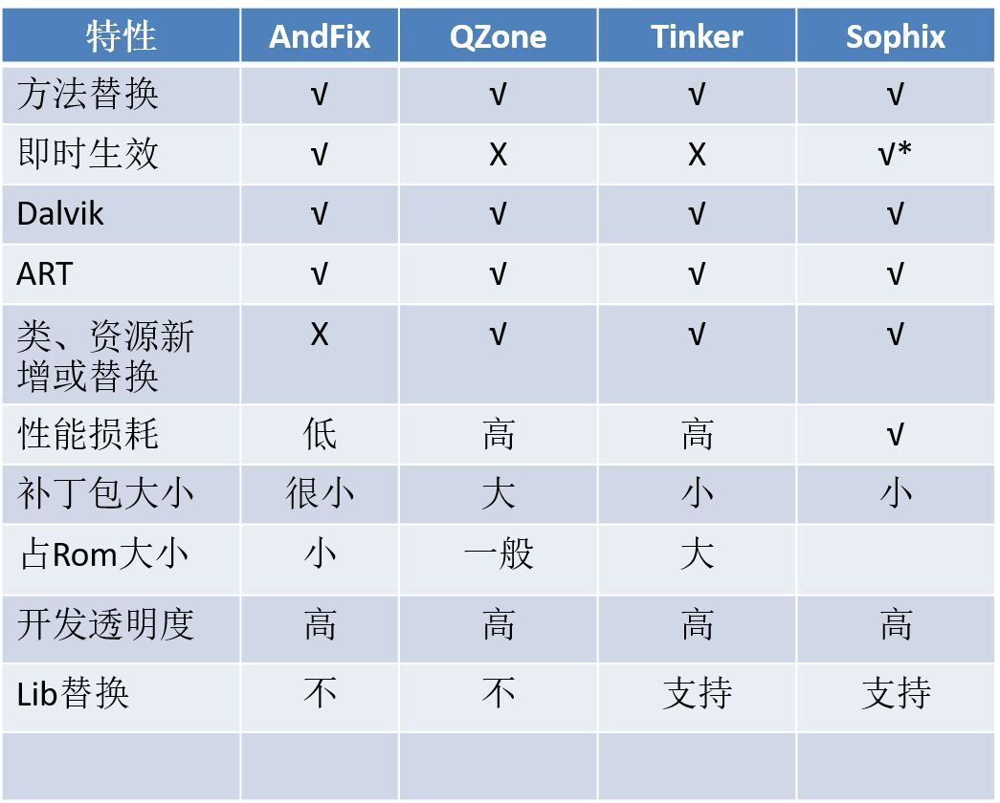
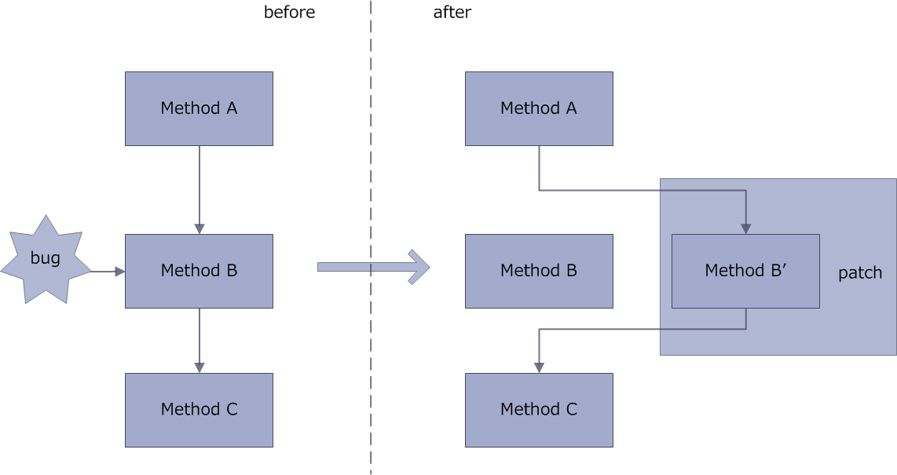
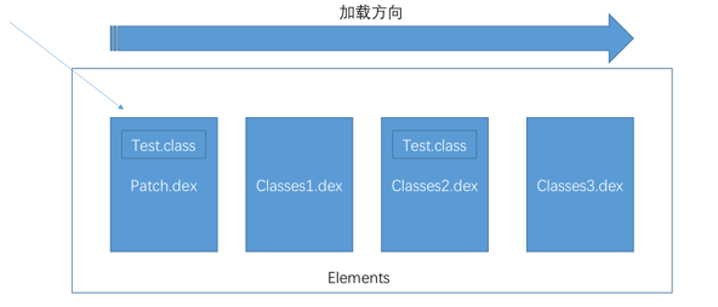
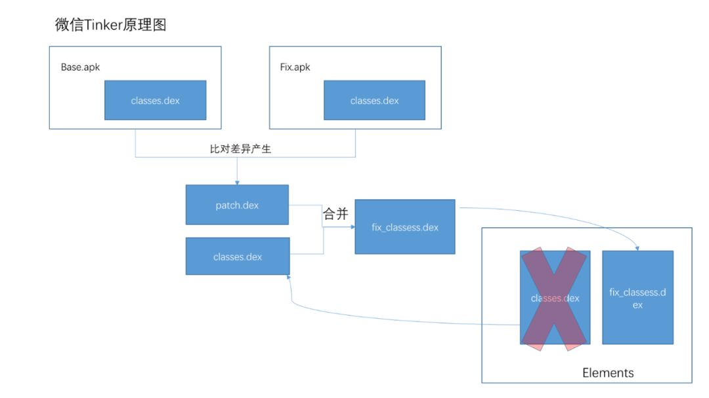

## 1 热修复核心

* 资源修复
* 代码修复
* 动态链接库修复

## 2 资源修复

资源修复参考 **Instant Run** 的资源修复原理。

* 创建 AssetManager，通过反射调用 addAssetPath 方法加载外部的的资源。
* 将 AssetManager 类型的 mAssets 字段的引用全部替换成新创建的 AssetManager。

### 2.1 Instant Run

Instant Run 是 AS 2.0 新增的运行机制，其运行如下：


## 3 代码修复

代码修复主要有三个方案：

* 类加载方案
* 底层替换方案
* Instant Run 方案

### 3.1 类加载方案

**基于 Dex 分包方案**

原理：


ClassLoad 加载类时候，调用 DexPatchList#findClass

```java
public Class<?> findClass(String name, List<Throwable> suppressed) {
     for (Element element : dexElements) {
          Class<?> clazz = element.findClass(name, definingContext, suppressed);//查找类
         if (clazz != null) {
             return clazz;
         }
     }

     if (dexElementsSuppressedExceptions != null) {
         suppressed.addAll(Arrays.asList(dexElementsSuppressedExceptions));
     }
     return null;
}
```

* Element 内部封装 DexFile，DexFile 用于加载 dex 文件，每个 dex 文件对应一个 Element；
* 多个 Element 组成有序的数组 dexElements，查找类就是遍历这个数组；
* Key.class 这个类有 bug，我们将 Key.class 修改之后，打一个新 dex 包 Patch.dex，放到 Element 数组的第一个，一旦查找到该类，后面那个有 bug 的 Key.class 就不会被加载从而达到修复 bug 的目的。

缺点：

* 需要重启 App，不能即时生效，这是由于 App 运行时候，相关的类无法被卸载，需要重新启动 App。

**Tinker原理**：新旧包做 diff，比较生成一个 patch.dex，与手机中的 APK 的 classes.dex 做合并，生成一个新的 classes.dex，反射把这个 classes.dex 放到 Element 的第一个元素。 

### 3.2 底层替换方案

直接在 Native 层修改原有类。替换 ArtMenthod 结构体中的字段或者整个 ArtMethod 结构体。

### 3.3 Instant Run 方案

Instant Run 在第一次构建 APK 会在每个方法中使用 AMS 注入类似的代码：

```java
IncrementalChange localIncrementalChange = $change//类有修改，则不为空
if(localIncrementalChange != null){
     //执行修改类
      ...
}

```

## 4 动态链接库修复

主要应用 System 下面这两个方法：

* System.load：参数是 so 在磁盘中的完整路径，加载指定路径的 so
* System.loadLibrary：参数是 so 的名称，用于加载 App 安装后从 apk 包复制到 data/data/packagename/lib 目录下的 so 库

上面最后都调用 nativeLoad 这个 native 方法去加载so库， 这个方法的参数 fileName（so库在磁盘中的完整路径名）。最后调用 LoadNativeLibrary 函数加载类，方法和 类加载方案类似。

总结：

* 将 so 补丁插入到 NativeLibraryElement 数组前部，让 so 补丁的路径先被返回和加载。
* 调用 System 的 load 的方案来接管 so 的加载入口

## 热修复流派



### 底层替换方案

底层替换方案限制颇多，但时效性最好，加载轻快，立即见效。
代表：支付宝的Andfix

### 类加载方案

类加载方案时效性差，需要重新冷启动才能见效，但修复范围广，限制少。
代表：百度实现的HotFix、QQ空间补丁技术、Qfix方案、微信的Tinker方案

### 融合方案

两种方案的结合，优势互补。
代表：Sophix

### Andfix



AndFix的思想是直接更改修复的方法，就是找到这个类中需要修复的函数然后调用replaceMethod方法。在Native层使用指针替换的方式替换bug方法，以达到修复bug的目的。

优点：

- BUG修复的即时性
- 补丁包同样采用差量技术，生成的PATCH体积小
- 对应用无侵入，几乎无性能损耗

不足：

- 只能基于方法修复，而且对平台的兼容性不佳，
- 不支持新增字段，以及修改方法，也不支持对资源的替换。

### QQ空间超级补丁技术



超级补丁技术原理是基于Android Dex分包方案的,而Dex分包方案的关键就是Android的ClassLoader体系。

关键点：DexClassLoader可以用来执行没有安装的程序代码

除了类加载问题之外还存在CLASS_ISPREVERIFIED标记的问题：
只要在static方法，构造方法，private方法，override方法中直接引用了其他dex中的类，那么这个类就不会被打上CLASS_ISPREVERIFIED标记。

解决方案：在所有类的构造函数中插入这行代码 System.out.println(AntilazyLoad.class);

超级补丁技术原理是基于Android Dex分包方案的,而Dex分包方案的关键就是Android的ClassLoader体系。把多个dex文件塞入到app的classloader之中android加载的时候，如果有多个dex文件中有相同的类，就会加载前面的类，原理就是把有问题的类替换掉，把需要的类放到最前面，达到热补的目的。

优点：

- 没有合成整包(和微信Tinker比起来)，产物比较小，比较灵活
- 可以实现类替换，兼容性高

不足：

- 不支持即时生效，必须通过重启才能生效。
- 在ART模式下，如果类修改了结构，就会出现内存错乱的问题。为了解决这个问题，就必须把所有相关的调用类、父类子类等等全部加载到patch.dex中，导致补丁包异常的大，进一步增加应用启动加载的时候，耗时更加严重。

### Tinker



Tinker也是Dex加载原理, 不同是，Tinker 下发新旧DEX的差异包，优化了DexDiff算法实现dexPatch体积更小。然后将差异包和旧包合成新dex之后进行dex的全量替换，避免了QQ补丁中的插桩操作。

全量合成新dex，消除重复class重复带来的冲突

优点：

- 合成整包，不用在构造函数插入代码。
- 性能提高。兼容性和稳定性比较高。
- 开发者透明，不需要对包进行额外处理。

不足：

- 不支持即时生效，必须通过重启应用的方式才能生效。
- 开启新的进程才能进行合并，并且很容易因为内存消耗等原因合并失败。
- 合并时占用额外磁盘空间，对于多DEX的应用来说，如果修改了多个DEX文件，就需要下发多个patch.dex与对应的classes.dex进行合并操作时这种情况会更严重，因此合并过程的失败率也会更高。

### Sophix

Sophix的代码修复同时涵盖底层替换方案和类加载方案。在补丁生成阶段，补丁工具会根据实际代码变动情况进行自动选择，针对小修改，在底层替换方案限制范围内的，就直接采用底层替换修复方案，而对于代码修改超出底层替换限制的，会使用类加载替换，此时及时性没那么好。
另外，运行时阶段，Sophix还会再判断所运行的机型是否支持热修复，这样即使补丁支持热修复，但由于机型底层虚拟机构造不支持，还是会走类加载修复，从而达到最好的兼容性。

整个资源替换的方案优势在于：

- 不修改AssetManager的引用处，替换更快更完全。(对比Instanat Run以及所有copycat的实现)
- 不必下发完整包，补丁包中只包含有变动的资源。(对比Instanat Run、Amigo等方式的实现)
- 不需要在运行时合成完整包。不占用运行时计算和内存资源。(对比Tinker的实现)

So修复：类似类修复反射注入方式。把补丁so库的路径插入到nativeLibraryDirectories数组的最前面，就能够达到加载so库的时候是补丁so库，而不是原来so库的目录，从而达到修复的目的。采用这种方案，完全由Sophix在启动期间反射注入patch中的so库

优点：

- Sophix集成简单，不需要配置繁琐的各种参数。
- Sophix支持即时生效（事实上我第一次运行first版本后，直接就弹出了toast，而此时后台数据显示设备加载成功数为1，设备推送成功数为0）。
- Sophix支持run instant，而tinker不支持。编译中不支持run instant，速度大大降低！
- Sophix的补丁是基于阿里自身的SophixPatchTool打包生成，不是在AS中生成的，有种解耦的感觉，而且不需要备份太多的版本。

不足：

- 收费
