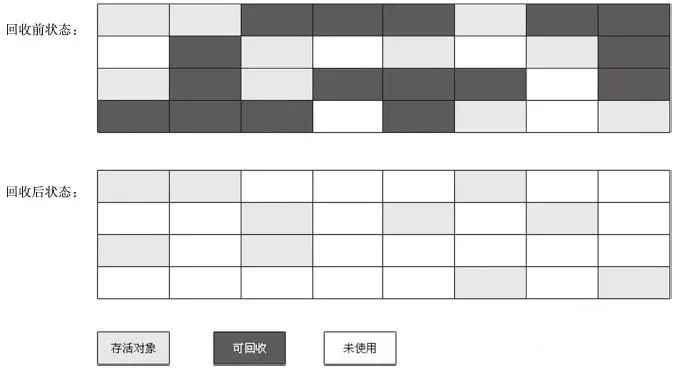
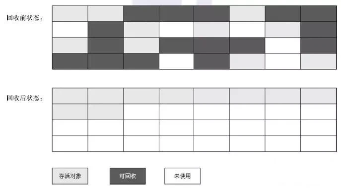
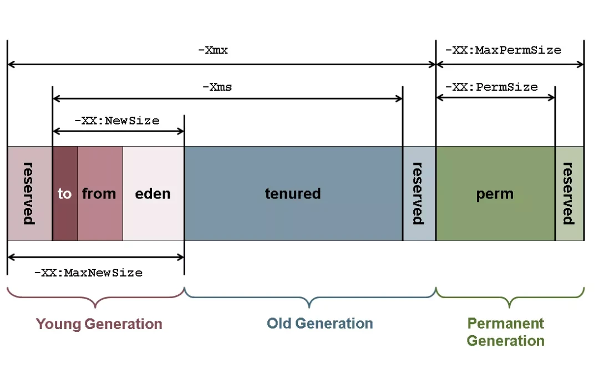

## Java内存模型

- 按照官方的说法：Java 虚拟机具有一个堆，堆是运行时数据区域，所有类实例和数组的内存均从此处分配。
- JVM主要管理两种类型内存：堆和非堆，堆内存（Heap Memory）是在 Java 虚拟机启动时创建，非堆内存(Non-heap Memory)是在JVM堆之外的内存。

JVM 内存包含如下几个部分

1. 堆内存（Heap Memory）： 存放Java对象
2. 非堆内存（Non-Heap Memory）： 存放类加载信息和其它meta-data
3. 其它（Other）： 存放JVM 自身代码等

## GC垃圾回收的原理

原理: 就是判断出死亡的对象，然后清除死亡的，留下存活的即可。

常有的有以下两种方法：

1. 引用计数法（Reference Counting）
2. 可达性分析算法（Reachability Analysis）

### 引用计数法

在对象中添加一个引用计数器，每当一个地方引用它时，计数器就加1；当引用失效时，计数器就减1；当引用计数为0时就会被回收。但是它存在一个很大的问题就是循环引用：如下图，当实例化A时，A会持有实例B，B会持有C，C持有A。这样一来我们就会发现:如果需要回收A，除了释放初始实例化引用，还需要释放C的引用。但是由于ABC互相引用，所以就造成谁也无法释放。主流的垃圾回收都没有采用这种判断方法，因为需要额外的工作来解决它（感兴趣的童鞋可以看看智能指针）。

### 可达性分析算法

在JAVA虚拟机中就是通过可达性分析法来判定对象是否存活的。思路是通过“GC Roots”的对象（可以认为是确定固定存在的对象）作为起始点，然后从这些节点开始遍历所有引用链，如果某个对象没有GC Roots直接或间接的连接的话，这个对象（白色节点）就被认为程序中不再使用可以被回收了。

在 Java 中常被用于GC Root的类型如下：

1. (函数未出栈时的)局部变量。
2. 静态变量。
3. 存活状态的线程。
4. Native 方法中 JNI 引用的对象。

## 垃圾回收的几种算法

### mark-sweep 标记清除法

如上图，黑色区域表示待清理的垃圾对象，标记出来后直接清空。

该方法简单快速，但是缺点也很明显，会产生很多内存碎片。

### mark-copy 标记复制法

思路也很简单，将内存对半分，总是保留一块空着（上图中的右侧），将左侧存活的对象（浅灰色区域）复制到右侧，然后左侧全部清空。

避免了内存碎片问题，但是内存浪费很严重，相当于只能使用 50%的内存。

### mark-compact 标记-整理（也称标记-压缩）法

避免了上述两种算法的缺点，将垃圾对象清理掉后，同时将剩下的存活对象进行整理挪动（类似于 windows 的磁盘碎片整理），保证它们占用的空间连续，这样就避免了内存碎片问题，但是整理过程也会降低 GC 的效率。

### generation-collect 分代收集算法

- JVM内存模型中Heap区分两大块，一块是 Young Generation，另一块是Old Generation
- 在Young Generation中，有一个叫Eden Space的空间，主要是用来存放新生的对象，还有两个Survivor Spaces（from、to），它们的大小总是一样，它们用来存放每次垃圾回收后存活下来的对象。
- 在Old Generation中，主要存放应用程序中生命周期长的内存对象。
- 在Young Generation块中，垃圾回收一般用Copying的算法，速度快。每次GC的时候，存活下来的对象首先由Eden拷贝到某个SurvivorSpace，当Survivor Space空间满了后，剩下的live对象就被直接拷贝到OldGeneration中去。因此，每次GC后，Eden内存块会被清空。
- 在Old Generation块中，垃圾回收一般用mark-compact的算法，速度慢些，但减少内存要求。
- 垃圾回收分多级，0级为全部(Full)的垃圾回收，会回收OLD段中的垃圾；1级或以上为部分垃圾回收，只会回收Young中的垃圾，内存溢出通常发生于OLD段或Perm段垃圾回收后，仍然无内存空间容纳新的Java对象的情况。增量式GC
- 增量式GC（Incremental GC），是GC在JVM中通常是由一个或一组进程来实现的，它本身也和用户程序一样占用heap空间，运行时也占用CPU。
- 当GC进程运行时，应用程序停止运行。当GC运行时间较长时，用户能够感到Java程序的停顿，另外一方面，如果GC运行时间太短，则可能对象回收率太低.
- 增量式GC就是通过一定的回收算法，把一个长时间的中断，划分为很多个小的中断，通过这种方式减少GC对用户程序的影响。
- Sun JDK提供的HotSpot JVM就能支持增量式GC。HotSpot JVM缺省GC方式为不使用增量GC，为了启动增量GC，我们必须在运行Java程序时增加-Xincgc的参数。
- HotSpot JVM增量式GC的实现是采用Train GC算法，它的基本想法就是：将堆中的所有对象按照创建和使用情况进行分组（分层），将使用频繁高和具有相关性的对象放在一队中，随着程序的运行，不断对组进行调整。当GC运行时，它总是先回收最老的（最近很少访问的）的对象，如果整组都为可回收对象，GC将整组回收。这样，每次GC运行只回收一定比例的不可达对象，保证程序的顺畅运行。

> 分代管理是很多 JVM 虚拟机对于堆 (heap) 内存的管理机制，最为人熟知的是新生代 (Young Generation)、老年代 (Old Generation) 和永久代 (Permanent Generation) 这一组名词，这也是很多人讲 GC 时的默认组合。事实上，这一组名词是 Oracle 的 HotSpot 中对于 JDK 1.7及之前的实现方式。至于其他的 JVM 实现，可以选择是否采用分代管理的机制。
> 比如 Dalvik 就没有采用分代管理的机制，ART 在 Android 8 (Oero) 和 9 (Pie) 版本未使用分代管理、其他的版本又采用了该机制。
> 在分代管理的虚拟机中，新生代和老年代正如它们的名字一样，分别存储了新创建的对象和存活了很久的对象；新的对象会在新生代中创建，经过一定次数的 GC 后依然存活的对象，会被复制到老年代中(有些虚拟机新生代分为更多的区域，以达到的最佳的性能表现)。

## 参考

[Android 冷知识，我要被 GC 了...](https://mp.weixin.qq.com/s/UeVt4eMnGFlEjGuLx5K8kg)