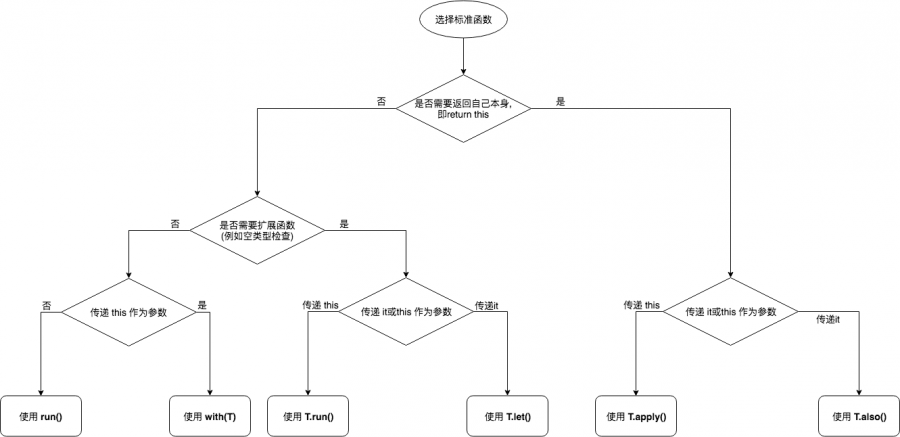

# 作用域函数

Kotlin中提供了一系列的作用域函数，这些函数写起来很简单，但是提供的功能很强大。他们是带接受者的Lambda。不过对于Lambda有一点需要注意：**在lambda表达式，只支持单抽象方法模型，也就是说设计的接口里面只有一个抽象的方法，才符合lambda表达式的规则，多个回调方法不支持。**

## let

let扩展函数的实际上是一个作用域函数，当你需要去定义一个变量在一个特定的作用域范围内，let函数的是一个不错的选择；let函数另一个作用就是*可以避免写一些判断null的操作*。

1. let的源码

```java
/**
 * Calls the specified function [block] with `this` value as its argument and returns its result.
 */
@kotlin.internal.InlineOnly
public inline fun <T, R> T.let(block: (T) -> R): R {
    contract {
        callsInPlace(block, InvocationKind.EXACTLY_ONCE)
    }
    return block(this)
}
```

2. 分析

从源码let函数的结构来看它是只有一个lambda函数块block作为参数的函数，调用T类型对象的let函数，则该对象为函数的参数。在函数块内可以通过 it 指代该对象。返回值为函数块的最后一行或指定return表达式。

3. 适用场景

- **场景一**: 最常用的场景就是使用let函数处理需要针对一个可null的对象统一做判空处理。
- **场景二**: 然后就是需要去明确一个变量所处特定的作用域范围内可以使用

```java
override fun onAttach(context: Context?) {
    super.onAttach(context)
 
    arguments?.getParcelable<ImageInfo>("images")?.let {
        imageInfo = it
    }
}
```

4. 优势

- T.let函数提供了一种更清晰的区分方式去使用给定的变量函数/成员与外部类函数/成员。
- 例如当it作为函数的参数传递时，this不能被省略，并且it写起来比this更简洁，更清晰。
- T.let允许更好地命名已转换的已使用变量，即可以将it转换为其他有含义名称，而 T.run则不能，内部只能用this指代或者省略。

## with

with是将某对象作为函数的参数，在函数块内可以通过 this 指代该对象。返回值为函数块的最后一行或指定return表达式。

1. with的源码

```java
/**
 * Calls the specified function [block] with the given [receiver] as its receiver and returns its result.
 */
@kotlin.internal.InlineOnly
public inline fun <T, R> with(receiver: T, block: T.() -> R): R {
    contract {
        callsInPlace(block, InvocationKind.EXACTLY_ONCE)
    }
    return receiver.block()
}
```

2. 分析

with函数把它的第一个参数转换成第二个参数传给它的lambda的接受者。可以显示的通过this引用来访问这个接受者。或者按照惯例，可以省略this引用，不用任何限定符直接访问这个值的方法和属性。

## run

1. 源码

```java
/**
 * Calls the specified function [block] and returns its result.
 */
@kotlin.internal.InlineOnly
public inline fun <R> run(block: () -> R): R {
    contract {
        callsInPlace(block, InvocationKind.EXACTLY_ONCE)
    }
    return block()
}
```

2. 分析

run函数实际上可以说是let和with两个函数的结合体，run函数只接收一个lambda函数为参数，以闭包形式返回，返回值为最后一行的值或者指定的return的表达式。

3. 适应场景

适用于let,with函数任何场景。因为run函数是let,with两个函数结合体，准确来说它弥补了let函数在函数体内必须使用it参数替代对象，在run函数中可以像with函数一样可以省略，直接访问实例的公有属性和方法，另一方面它弥补了with函数传入对象判空问题，在run函数中可以像let函数一样做判空处理。

## apply

apply函数几乎和with函数一模一样，唯一的区别是apply始终会返回作为实参传递给它的对象。

1. 源码

```java
/**
 * Calls the specified function [block] with `this` value as its receiver and returns `this` value.
 */
@kotlin.internal.InlineOnly
public inline fun <T> T.apply(block: T.() -> Unit): T {
    contract {
        callsInPlace(block, InvocationKind.EXACTLY_ONCE)
    }
    block()
    return this
}
```

2. 适用场景

apply一般用于一个对象实例初始化的时候，需要对对象中的属性进行赋值，例如在fragment的newInstance时可以使用

```java
@JvmStatic
fun newInstance(imageInfo: ImageInfo) = XXXXFragment().apply {
    arguments = Bundle().apply {
        putParcelable("images", imageInfo)
    }
}
```

## also

also函数的结构实际上和let很像唯一的区别就是返回值的不一样，let是以闭包的形式返回，返回函数体内最后一行的值，如果最后一行为空就返回一个Unit类型的默认值。而also函数返回的则是传入对象的本身。

1. 源码

```java
/**
 * Calls the specified function [block] with `this` value as its argument and returns `this` value.
 */
@kotlin.internal.InlineOnly
@SinceKotlin("1.1")
public inline fun <T> T.also(block: (T) -> Unit): T {
    contract {
        callsInPlace(block, InvocationKind.EXACTLY_ONCE)
    }
    block(this)
    return this
}
```

2. 适用场景

适用于let函数的任何场景，also函数和let很像，只是唯一的不同点就是let函数最后的返回值是最后一行的返回值而also函数的返回值是返回当前的这个对象。一般可用于多个扩展函数链式调用。

它有一些很好的优点。

- 它可以对相同的对象提供非常清晰的分离过程，即创建更小的函数部分。
- 在使用之前，它可以非常强大的进行自我操作，从而实现整个链式代码的构建操作。



## 参考

1. [掌握Kotlin中的标准库函数: run、with、let、also和apply](https://blog.csdn.net/u013064109/article/details/80387322)
2. [Kotlin系列之let、with、run、apply、also函数的使用](https://blog.csdn.net/u013064109/article/details/78786646)